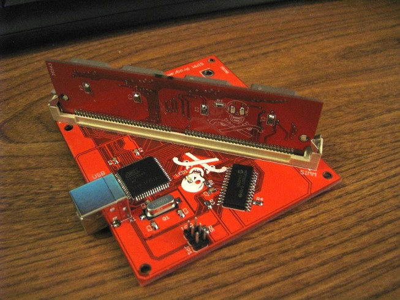

This project is a bootloader and firmware for a Macintosh ROM SIMM programmer, along with control software for Mac OS X, Windows, and Linux. The ROM SIMM is compatible with the SE/30, all II-series Macs with a 64-pin SIMM socket (should include the IIx, IIcx, IIci, IIfx, and IIsi), and the Quadra 700.

Schematics and PCB layouts for the ROM SIMM and the ROM SIMM programmer are also available for non-commercial use.

No ROM images will be distributed; this is a tool for personal exploration.

