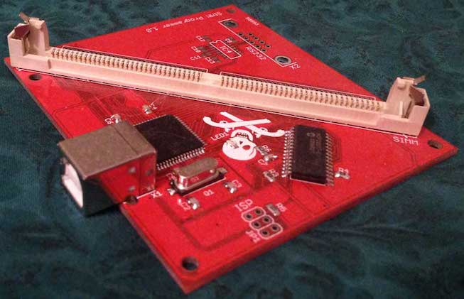
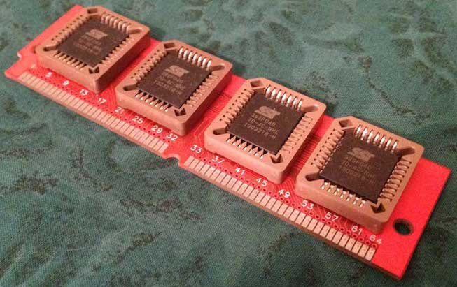
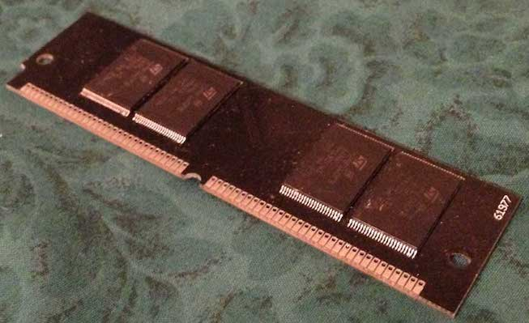

# Macintosh ROM SIMM programmer

This project is a [bootloader](https://github.com/dougg3/mac-rom-simm-programmer.bootloader) and [firmware](https://github.com/dougg3/mac-rom-simm-programmer.software) for a Macintosh ROM SIMM programmer, along with [control software](https://github.com/dougg3/mac-rom-simm-programmer) for Mac OS X, Windows, and Linux plus a [Windows INF USB driver](https://github.com/dougg3/mac-rom-simm-programmer.windriver). The ROM SIMM is compatible with the SE/30, all II-series Macs with a 64-pin SIMM socket (should include the IIx, IIcx, IIci, IIfx, and IIsi), and the Quadra 700.

The programmer and software supports 2 MB and 8 MB SIMMs.

[Schematics and PCB layouts](https://github.com/dougg3/mac-rom-simm-programmer.cad) for the ROM SIMM and the ROM SIMM programmer are also available for non-commercial use.

No ROM images will be distributed; this is a tool for personal exploration.

# Images (click on them for a larger version):

- Programmer with 8 MB SIMM

- Programmer

- 2 MB SIMM

- 8 MB SIMM

